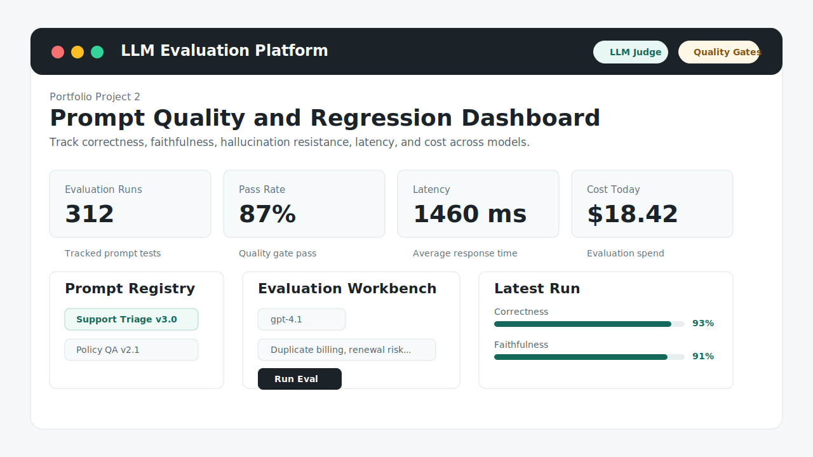
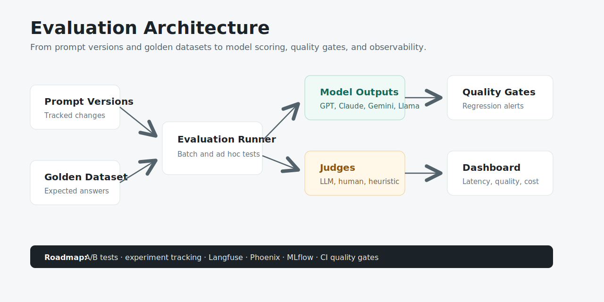

# LLM Evaluation Platform

A portfolio-grade AI quality platform for testing prompts, comparing models, tracking regressions, and monitoring correctness, faithfulness, hallucination risk, latency, and cost.

[](https://divyadhole.github.io/llm-evaluation-platform/)
[](http://localhost:8100/docs)
[](frontend)



## Why This Project Exists

AI companies increasingly need engineers who can measure and improve LLM quality, not just call a model API. This project demonstrates:

- Prompt versioning and regression testing
- Golden datasets and expected-answer evaluation
- LLM-as-judge, human judge, and heuristic judge patterns
- Model comparison across GPT, Claude, Gemini, and Llama-style providers
- Quality gates for correctness, faithfulness, hallucination resistance, and context recall
- Cost, latency, and quality dashboards
- A roadmap toward Langfuse, Phoenix, MLflow, OpenTelemetry, and CI quality gates

## Visual Architecture



## Product Snapshot

The app lets a user:

- Select a prompt version from a registry.
- Choose a model to evaluate.
- Run an ad hoc evaluation against an input and expected answer.
- Inspect quality metrics, thresholds, judge type, latency, and cost.
- Review golden dataset examples used for regression testing.
- Use a public demo mode without a hosted backend.

## Tech Stack

| Layer | Tools |
| --- | --- |
| Frontend | React, TypeScript, Vite, CSS, lucide-react |
| Backend | Python, FastAPI, Pydantic |
| Evaluation | LLM judges, human review, heuristics, golden datasets |
| Data Roadmap | PostgreSQL, Redis, experiment tables |
| Observability Roadmap | Langfuse, Phoenix, MLflow, OpenTelemetry |
| DevOps | Docker Compose, GitHub Actions, GitHub Pages |

## Current Features

- Typed FastAPI endpoints for prompts, datasets, runs, evaluations, feedback, and dashboard summary.
- Interactive React dashboard with keyboard-accessible controls and responsive layout.
- Demo mode for public portfolio viewing without backend hosting.
- Mock evaluation runner with thresholds and pass, warning, failed statuses.
- Docker Compose setup for backend, frontend, PostgreSQL, and Redis.
- CI workflow for backend tests and frontend builds.

## Run Locally

Backend:

```bash
cd backend
python3 -m venv .venv
source .venv/bin/activate
pip install -r requirements.txt
uvicorn app.main:app --reload --port 8100
```

Frontend:

```bash
cd frontend
npm install
npm run dev
```

Open `http://localhost:5175`.

Full stack with Docker:

```bash
docker compose up --build
```

## API Endpoints

- `GET /`
- `GET /health`
- `GET /api/summary`
- `GET /api/prompts`
- `GET /api/datasets`
- `GET /api/runs`
- `POST /api/evaluate`
- `POST /api/feedback`

## Validation

Backend tests:

```bash
cd backend
pytest
```

Frontend build:

```bash
cd frontend
npm run build
```

## Roadmap

### Milestone 2: Persistence and Experiments

- Add PostgreSQL tables for prompt versions, datasets, runs, metrics, and feedback.
- Add experiment tracking for model and prompt A/B tests.
- Add dataset upload and tagging.

### Milestone 3: Real Model Providers

- Add OpenAI, Anthropic, Google, and local model adapters.
- Store provider latency, token usage, and cost by run.
- Add replayable request and response traces.

### Milestone 4: Evaluation Engine

- Add deterministic metric plugins.
- Add LLM-as-judge rubrics.
- Add human review queue and disagreement tracking.

### Milestone 5: Observability

- Add Langfuse and OpenTelemetry tracing.
- Add Phoenix or MLflow experiment views.
- Add release quality gates in CI.

